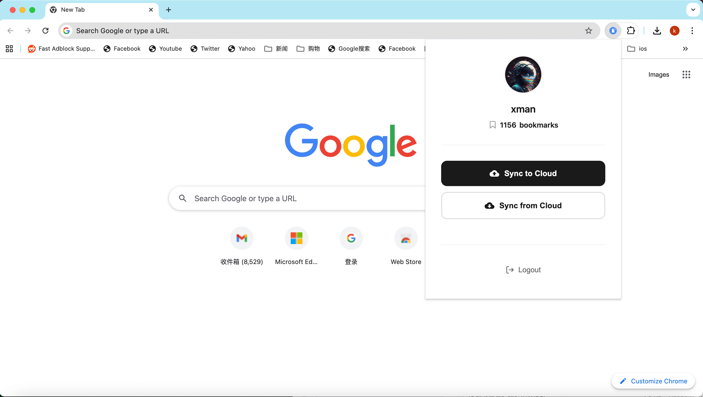

# XBrowser Bookmark Sync

[English](README-en.md) | [中文](README.md)

A Chrome extension designed for XBrowser that runs on any browser supporting Chrome extensions, enabling two-way synchronization between local bookmarks and the cloud.

## Features

Minimalist design, providing only essential bookmark sync functionality. Simply log in with your XBrowser account to start using it. If you have multiple PC browsers, you can also use your XBrowser account to sync bookmarks across multiple PC browser devices.



## Installation

### Install from Extension Store

- Chrome Web Store: https://chrome.google.com/webstore/detail/dbccejmmnkoaaffbliocemfkhabmemhe

- Microsoft Edge Add-ons: https://microsoftedge.microsoft.com/addons/detail/xbrowser-bookmark-sync/gdbkdcohpokcfaheiojfamnmfoniaeca

> If you find this extension useful, please leave a positive review. Thanks in advance! :)

### Install from CRX File

1. Download the [xbrowser-bookmark-sync.crx](https://www.xbext.com/download/xbrowser-bookmark-sync.crx) file to your local directory.

2. Open Chrome browser and navigate to the extensions management page
   - Method 1: Enter `chrome://extensions/` in the address bar
   - Method 2: Menu → More tools → Extensions

3. Enable "Developer mode" in the top right corner

4. Drag and drop the CRX file from your file manager to the extensions page to complete installation

### Developer Mode Installation

1. Download this project to your local machine

```bash
git clone https://github.com/examplecode/xbrowser-bookmark-sync.git
```
Or download the zip file [xbrowser-bookmark-sync.zip](https://www.xbext.com/download/xbrowser-bookmark-sync.zip) and extract it to your local directory.

2. Open Chrome browser and navigate to the extensions management page
   - Method 1: Enter `chrome://extensions/` in the address bar
   - Method 2: Menu → More tools → Extensions

3. Enable "Developer mode" in the top right corner

4. Click "Load unpacked"

5. Select the folder containing this project

6. Extension installation complete - click the toolbar icon to use

## Tech Stack

- Manifest V3
- Chrome Extension APIs
- Chrome Bookmarks API
- Chrome Storage API
- Vanilla JavaScript
- CSS3 Gradients & Animations

## File Structure
```
├── manifest.json          # Extension configuration file
├── popup.html             # Popup page
├── popup.js               # Main logic
├── background.js          # Background service
├── styles.css             # Stylesheet
├── icons/                 # Icon folder
│   ├── icon16.png
│   ├── icon48.png
│   ├── icon128.png
│   └── default-avatar.png
└── README.md              # Documentation
```

## Permissions

- `bookmarks`: Read and modify browser bookmarks
- `storage`: Store user login information
- `host_permissions`: Access cloud API

## Development

### Debugging

1. Click "Inspect views" on the extensions page to open developer tools
2. Check console logs for information
3. Click the refresh button to reload the extension after modifying code

## License

MIT License

## Contact

For questions or suggestions, please contact XBrowser technical support.
